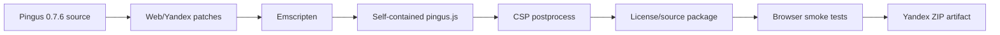

<p align="center">
  <strong>Оригинальный Pingus 0.7.6, портированный в браузер и адаптированный для Яндекс Игр.</strong>
</p>

<p align="center">
  
  
  
  
  
</p>

<p align="center">
  <a href="#-о-проекте">О проекте</a> ·
  <a href="#-возможности-порта">Возможности</a> ·
  <a href="#-сборка">Сборка</a> ·
  <a href="#-структура-репозитория">Структура</a> ·
  <a href="#-yandex-games-sdk">Yandex SDK</a> ·
  <a href="#-лицензия-и-исходный-код">Лицензия</a>
</p>

---

## 🐧 О проекте

**pingus-yandex-web-port** — WebAssembly-порт оригинального **Pingus 0.7.6** для запуска в браузере и публикации на платформе **Яндекс Игры**.

Цель проекта — сохранить оригинальный геймплей, уровни, визуальный стиль и поведение Pingus, одновременно добавить необходимый браузерный runtime и интеграцию с Yandex Games SDK.

> [!IMPORTANT]
> Это не ремейк и не игра «по мотивам». Веб-версия собирается из исходного кода оригинального Pingus и точечных патчей, необходимых для браузера и платформы Яндекс Игр.

## ✨ Возможности порта

| Возможность | Статус |
|---|:---:|
| Оригинальный игровой код Pingus 0.7.6 | ✅ |
| Компиляция C++ → WebAssembly через Emscripten | ✅ |
| Самодостаточный browser build | ✅ |
| Yandex Games SDK | ✅ |
| `LoadingAPI.ready()` / Game Ready | ✅ |
| `GameplayAPI.start()` / `stop()` | ✅ |
| Полноэкранная реклама в логических паузах | ✅ |
| Пауза игры и звука во время рекламы | ✅ |
| Локальные сохранения через IDBFS / IndexedDB | ✅ |
| Облачная синхронизация прогресса через Player Data | ✅ |
| Автоматический выбор языка через Yandex SDK | ✅ |
| Русский и английский интерфейс | ✅ |
| CSP-совместимая HTML/JS-обвязка | ✅ |
| Автоматические проверки контента и локализации | ✅ |
| Browser smoke test после сборки | ✅ |

## 🎮 Что изменено относительно desktop-версии

Порт старается менять оригинальную игру только там, где это необходимо для работы в браузере:

- фиксированный игровой framebuffer **800×600** с адаптивным масштабированием;
- браузерная обработка ввода, фокуса, паузы и аудио;
- сохранения в IndexedDB и синхронизация прогресса с Yandex Player Data;
- интеграция рекламы и событий жизненного цикла Яндекс Игр;
- русская локализация доступного игроку контента;
- оптимизации software-renderer для большого количества пингусов;
- адаптация карты мира, меню и отдельных UI-элементов под Web;
- CSP-safe bootstrap без inline-скриптов в финальном архиве;
- релизные проверки на проблемные или непереведённые публичные строки.

Оригинальный стиль фоновых изображений и их legacy-тайлинг намеренно сохраняются.

## ☁️ Сохранения

В релизной сборке используются два слоя сохранения:

```text
Pingus native save
      │
      ├──► IDBFS / IndexedDB ──► локальный fallback
      │
      └──► Yandex Player Data ──► облачная синхронизация прогресса
```

При запуске локальный и облачный прогресс объединяются так, чтобы прохождение уровня на одном устройстве не стирало более продвинутый результат с другого устройства.

## 🧩 Yandex Games SDK

Интеграция платформы находится в браузерной обвязке и включает:

- инициализацию `/sdk.js`;
- определение языка через `ysdk.environment.i18n.lang`;
- сигнал готовности после первого игрового кадра;
- Gameplay API во время активного уровня;
- platform pause/resume;
- полноэкранную рекламу после завершения уровня с cooldown;
- немедленное сохранение после значимых изменений;
- облачное хранение прогресса через `ysdk.getPlayer()`.

Подробнее о внутреннем устройстве: **[docs/ARCHITECTURE.md](docs/ARCHITECTURE.md)**.

## 🛠️ Сборка

Основной pipeline автоматизирован через **GitHub Actions**.

Высокоуровнево процесс выглядит так:



Главный сценарий сборки: [`tools/build_web.sh`](tools/build_web.sh).

Он применяет Web/Yandex-патчи, конвертирует несовместимые браузерные музыкальные форматы, собирает исходники Emscripten, формирует финальную оболочку и запускает релизные проверки.

### Финальный архив

Типичная структура готовой сборки:

```text
index.html
bootstrap.js
pingus.css
pingus.js
AUTHORS
COPYING
README.txt
BUILD-INFO.txt
SOURCE-OFFER.txt
PINGUS-CORRESPONDING-SOURCE.tar.gz
```

`pingus.js` содержит скомпилированный runtime и встроенные игровые данные. Отдельные `.wasm` и `.data` файлы для релизного архива не требуются.

## 📁 Структура репозитория

```text
.github/           GitHub Actions и шаблоны проекта
ci/                результаты автоматических smoke-тестов
web/               HTML-оболочка браузерной версии
scripts/           вспомогательные сценарии
src/               дополнительные исходники/портовые изменения, если применимо
tools/             патчи, аудиторы, упаковка и build pipeline
docs/              документация и оформление репозитория
README.md           главная страница проекта
```

Ключевые части:

| Путь | Назначение |
|---|---|
| `web/shell.html` | Исходная HTML-оболочка до CSP postprocess |
| `tools/build_web.sh` | Главная release-сборка |
| `tools/patch_yandex_*.py` | Интеграция Yandex Games и релизные правки |
| `tools/patch_web_*.py` | Browser/runtime/UI/performance-патчи |
| `tools/audit_*.py` | Проверки локализации и публичного контента |
| `ci/` | Зафиксированные результаты последних автоматических тестов |

## ✅ Release checks

Перед созданием артефакта pipeline проверяет, среди прочего:

- успешную компиляцию исходного C++;
- наличие всех обязательных файлов;
- отсутствие неожиданных внешних `.wasm` / `.data` payload;
- запуск браузерной версии до первого кадра;
- восстановление локального сохранения после reload;
- доступность публичных уровней;
- отсутствие непереведённых player-facing строк;
- отсутствие известных рискованных публичных текстовых/визуальных ссылок в релизном наборе.

## 🌍 Локализация

Релизная конфигурация поддерживает:

- 🇷🇺 **Русский**
- 🇬🇧 **English**

В Яндекс Играх язык выбирается автоматически через SDK. Английский является исходным языком игры; русский каталог формируется и проверяется во время build pipeline.

## 🤝 Разработка

Если вносишь изменения в порт, старайся отделять:

1. исправления браузерного runtime;
2. платформенную интеграцию Yandex Games;
3. изменения оригинального игрового поведения;
4. изменения публичного контента/локализации.

Это сильно упрощает проверку регрессий и позволяет понимать, где именно порт расходится с оригиналом.

Правила и рекомендации: **[CONTRIBUTING.md](CONTRIBUTING.md)**.

## 📜 Лицензия и исходный код

Pingus является свободным программным обеспечением. Релизная Web-сборка сохраняет юридически значимые материалы оригинального проекта и включает соответствующий исходный пакет:

- `COPYING`
- `AUTHORS`
- `SOURCE-OFFER.txt`
- `PINGUS-CORRESPONDING-SOURCE.tar.gz`

> [!NOTE]
> Этот репозиторий содержит инструменты и изменения, необходимые для Web/Yandex-порта. Права на оригинальные компоненты Pingus принадлежат их соответствующим авторам и участникам проекта.

---

<p align="center">
  <strong>🐧 Pingus on the Web — оригинальная игра, современный browser runtime.</strong>
</p>
